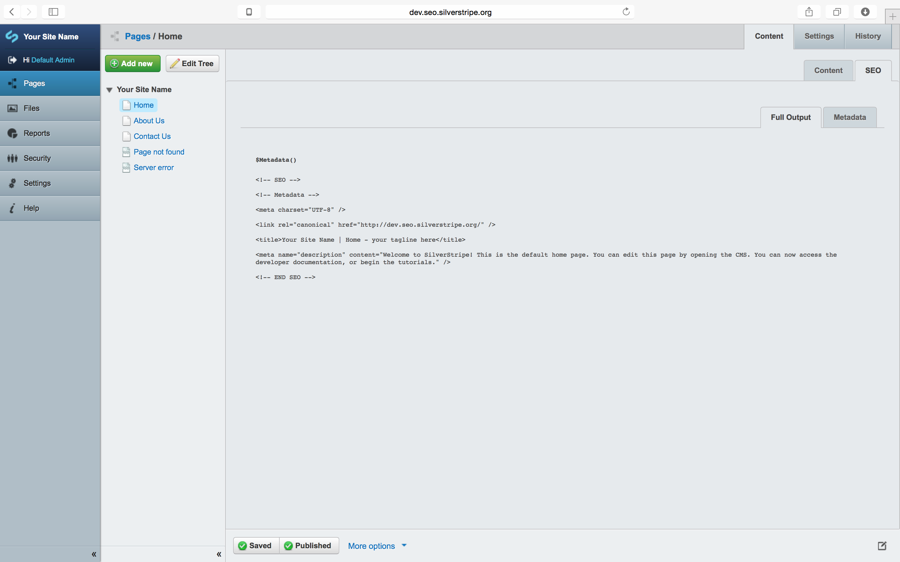
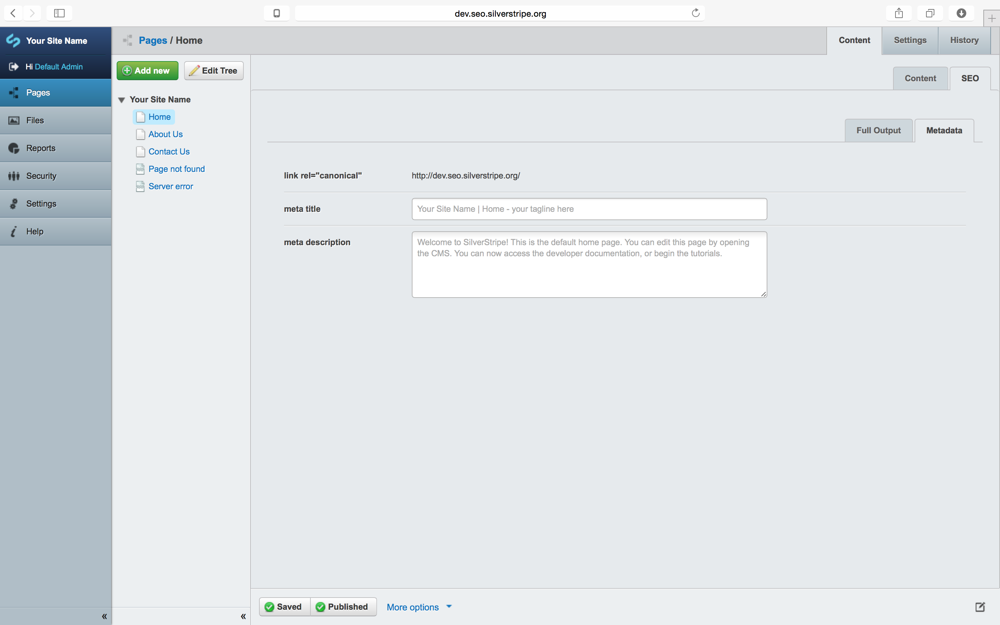
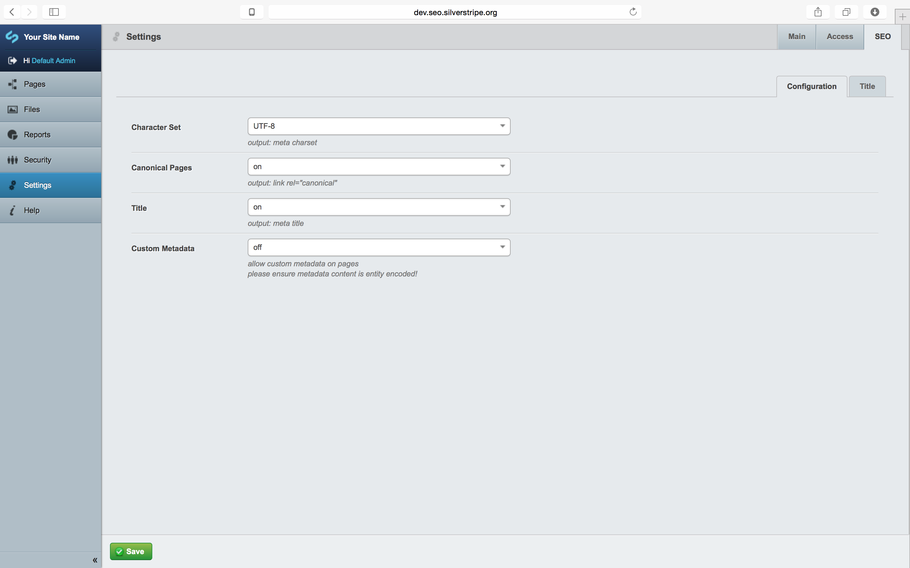
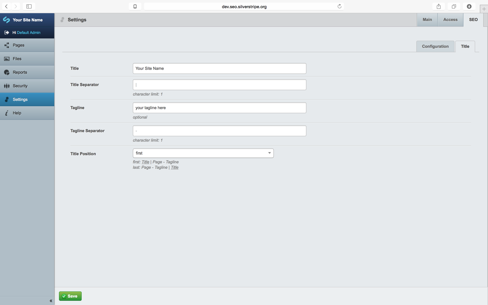

## Overview ##

This is the core metadata module for the graphiques-digitale/silverstripe-seo-* module collection.

It enables enhanced **_title_** features, **_character set_** selection, **_canonical URLs_** and an enhanced fall-back **_description_** using `$Content.FirstParagraph()`.

Title inspired by: [http://moz.com/learn/seo/title-tag][3]

It is intended to be used with it's siblings:
* [`Graphiques-Digitale/silverstripe-seo-icons`](https://github.com/Graphiques-Digitale/silverstripe-seo-icons)
* [`Graphiques-Digitale/silverstripe-seo-authorship`](https://github.com/Graphiques-Digitale/silverstripe-seo-authorship)
* [`Graphiques-Digitale/silverstripe-seo-facebook-insights`](https://github.com/Graphiques-Digitale/silverstripe-seo-facebook-insights)
* [`Graphiques-Digitale/silverstripe-seo-open-graph`](https://github.com/Graphiques-Digitale/silverstripe-seo-open-graph)
* [`Graphiques-Digitale/silverstripe-seo-twitter-cards`](https://github.com/Graphiques-Digitale/silverstripe-seo-twitter-cards)
* [`Graphiques-Digitale/silverstripe-seo-schema-dot-org`](https://github.com/Graphiques-Digitale/silverstripe-seo-schema-dot-org)

These are all optional and fragmented from the alpha version [`SSSEO`](https://github.com/Graphiques-Digitale/SSSEO), which is now redundant.

The whole module collection is based largely on [18 Meta Tags Every Webpage Should Have in 2013][1].

Also, a good overview: [5 tips for SEO with Silverstripe 3][2].

## Installation ##

#### Composer ####

* `composer require graphiques-digitale/silverstripe-seo-metadata`
* run `~/dev/build/?flush`

#### From ZIP ####

* Place the extracted folder `silverstripe-seo-metadata-{version}` into `silverstripe-seo-metadata` in the SilverStripe webroot
* run `~/dev/build/?flush`

## Template Usage ##

Depending on your configuration, the general idea is to replace all header content relating to metadata with `$Metadata()` just below the opening `<head>` tag and `<% base_tag %>` include, e.g.:

```html
<head>
	<% base_tag %>
	$Metadata()
	<!-- further includes ~ viewport, etc. -->
</head>
```

This will output something along the lines of:

```html
<head>
	<base href="http://dev.seo.silverstripe.org/"><!--[if lte IE 6]></base><![endif]-->
	
<!-- SEO -->
<!-- Metadata -->
<meta charset="UTF-8" />
<link rel="canonical" href="http://dev.seo.silverstripe.org/" />
<title>Your Site Name | Home - your tagline here</title>
<meta name="description" content="Welcome to SilverStripe! This is the default home page. You can edit this page by opening the CMS. You can now access the developer documentation, or begin the tutorials." />
<!-- END SEO -->

	<!-- further includes ~ viewport, etc. -->
</head>
```

## Issue Tracker ##

Issues are tracked on GitHub @ [Issue Tracker](https://github.com/Graphiques-Digitale/silverstripe-seo-metadata/issues)

## Development and Contribution ##

Please get in touch @ [`hello@graphiquesdigitale.net`](mailto:hello@graphiquesdigitale.net) if you have any extertise in any of these SEO module's areas and would like to help ~ they're a lot to maintain, they should be improved continually as HTML evolves and I'm sure they can generally be improved upon by field experts.






[1]: https://www.iacquire.com/blog/18-meta-tags-every-webpage-should-have-in-2013
[2]: http://www.silverstripe.org/blog/5-tips-for-seo-with-silverstripe-3-/
[3]: http://moz.com/learn/seo/title-tag
[4]: https://github.com/audreyr/favicon-cheat-sheet
[5]: http://www.jonathantneal.com/blog/understand-the-favicon/
[6]: http://blogs.msdn.com/b/ie/archive/2012/06/08/high-quality-visuals-for-pinned-sites-in-windows-8.aspx
[7]: https://developers.facebook.com/docs/platforminsights/domains
[8]: http://ogp.me
[9]: https://dev.twitter.com/cards/overview
[10]: https://developers.google.com/+/web/snippet/
[11]: https://mathiasbynens.be/notes/touch-icons